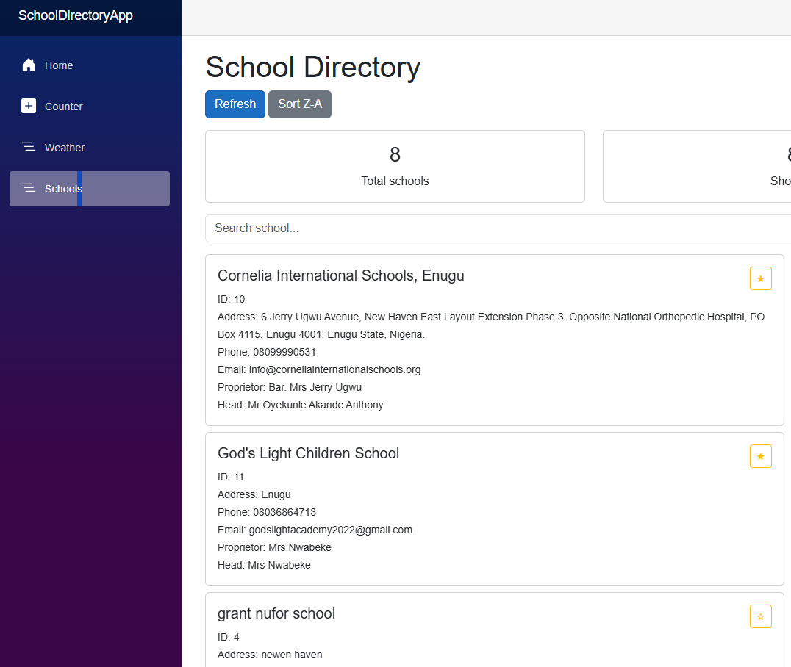
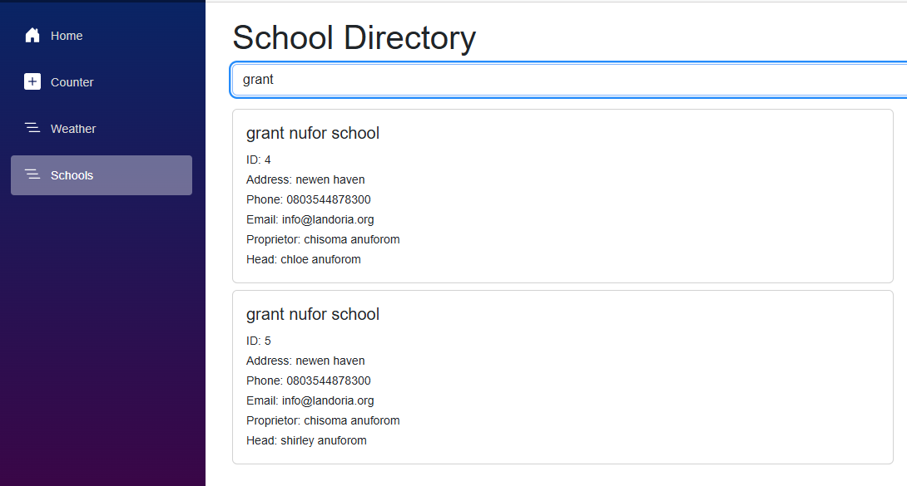
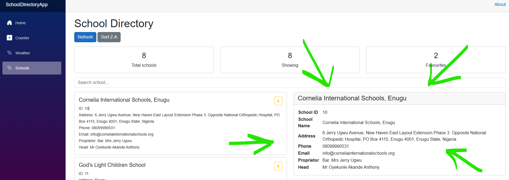
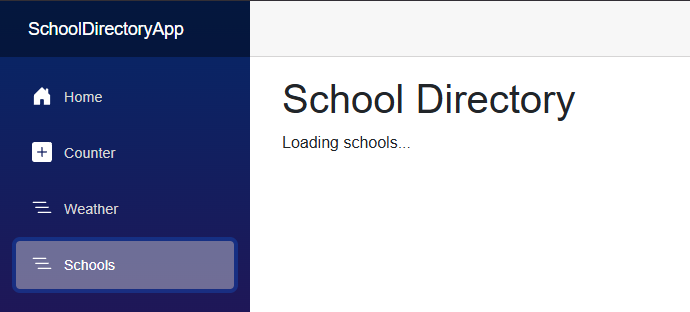
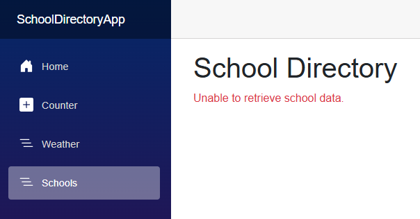

# CA1 Assignment (20%)


# School Directory App

A Blazor Web App that consumes the Edutots School API and shows a directory of schools. Users can see all schools, search by name, and click a school to see its details.

## Extras Features

- List of all schools from the API
- Search schools by name
- Click a school to see its details
- Loading message while data is being retrieved
- Error message if the API fails
- Refresh button to reload the data
- Sort schools by name (A-Z / Z-A)
- Mark schools as favourites
- Statistics panel with total schools, schools showing and favourites
- Responsive layout with Bootstrap

## Technologies Used

- C# and .NET 10
- Blazor Web App (Interactive Server)
- HttpClient with System.Net.Http.Json
- Bootstrap
- Git and GitHub

## API Endpoint

```
GET https://edutots.net/api/school
```

The app only uses these fields from the response: SchoolId, SchoolName, Address, PhoneNo, EmailAddress, ProprietorFullName and HeadFullName.

## Project Structure

```
SchoolDirectoryApp
├── Models
│   └── School.cs
├── Services
│   └── SchoolService.cs
├── Components
│   ├── SchoolCard.razor
│   ├── SchoolDetails.razor
│   └── Pages
│       └── Schools.razor
└── Program.cs
```

## How to Run

1. Install the .NET SDK.
2. Clone the repository:
```
   git clone https://github.com/ferdnandow/SchoolDirectoryApp.git
```
3. Go to the project folder:
```
   cd SchoolDirectoryApp
```
4. Run the app:
```
   dotnet run
```
5. Open the URL shown in the terminal and go to `/schools`.

## Screenshots

### School list


### Search


### School details


### Loading state


### Error state

